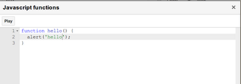

.. _Custom Script:

Custom Script
--------------

**The Custom script dialog**

The custom JS dilaog contains a play button and an editor for writing JS methods. Clicking the play button will immediately inject the script in the tab under record and executes it. Note that the added JS functions belong to the current project, so each script underneath could invoke the methods.

**Why do we need the custom JS methods**

Experienced devs/testers always want to do more things like handling an edge case that is hard to record, adding complicated validations, or even making an xmlHttpRequest to fetch data from server, etc. All these things could be achieved by writing up some JS methods. Basically, using custom JS, you could achieve anything you want in Javascript, so as to extend the RITE capability.

**How to use the custom JS methods**

Once you have the hello function defined, let's close the dialog and add call(hello); to a new line in the RITE main console editor. As a result, when RITE executes the line, it will inject the function in page and run it. You could also define arguments in your method, and invoke it by call(hello, arg1, arg2, etc); 

**Async calls**

Sometimes we might want to call a server API to fetch data and proceed. Suppose we have the following custom methods defined::

	function hello(sendRequestBack) {
	  setTimeout(function() {hi(sendRequestBack);}, 2000);
	}

	function hi(sendRequestBack) {
	  alert('delayed alert.');
	  sendRequestBack(true);
	}

In this case, we could invoke it by call(true, sendResultToBackground, hello); By passing true as the first parameter, RITE will understand it's an async call, and users need to explicitly call the sendResultToBackground method (pre-defined) to finish the aysnc call, otherwise, RITE will keep waiting until it's timeout.

**Returning results**

Again, this could potentially make RITE complicated, so we are still considering how to implement. Some thoughts could be instead of returning results, users directly assign values to ContentMap, which serves as a "global" storage object, and use it somewhere else in the script later. Any suggestions are welcomed.

   **Comments**

      You do not have permission to add comments.
