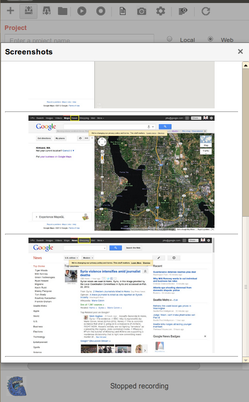

Screenshots
-----------

In the main console toolbar, there is a screenshot button which displays the screenshots collected during recording. 
Note that RITE only captures the screenshot for basic actions like click, type, but not for the advanced actions like verification. 
The screenshots could be saved along with the script, note that there is a limitation on the total screenshots size, which can not exceed 32MB.

**Comments**

  You do not have permission to add comments.
