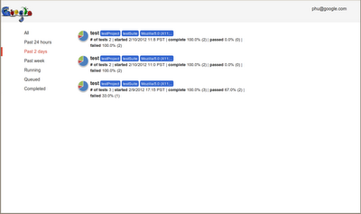
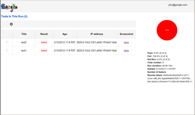

Runs and results
----------------

After running multiple scripts of a project, RITE will return two links, one for runs overview and the other for results overview. Let's say we've run two scripts and both failed, you'll see the followings.

Runs overview

Results overview

At this point, if you click on the "here" link in the result page, you'll see the screenshot captured when it failed.

   **Comments**

      You do not have permission to add comments.
